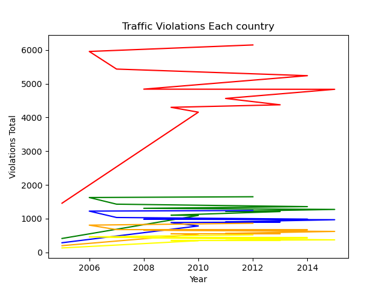
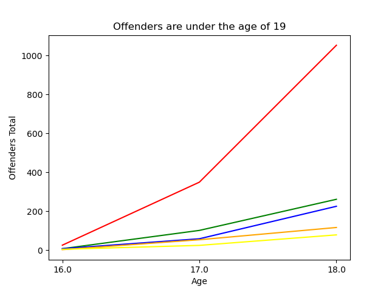

# Data Visualization Of Group D

## Visualization Scenarios

------------------------------------------------------------------------------------------------------------

### Stage 1: Data Visualization in Data Exploration

0. **Aspect**:
    - **Question**: I want to analyze the relationship between drug abuse and traffic violations.
    - **Graph & Analysis**:
        <!-- TODO: Grafik hasil analisa 1 -->

        <!-- TODO: Grafik hasil analisa 2 (optional) -->

        <!-- TODO: Hasil dari grafik yang dihasilkan ? -->

1. **Aspect One**:
    - **Question**: *How many traffic violations occur each year each country ?*
    - **Graph & Analysis**: 

2. **Aspect Two**:
    - **Question**: *How many offenders are between age of 16 and age of 19 ?*
    - **Graph & Analysis**: 

3. **Aspect Three**:
    - **Question**: *What are the categories of traffic violations that occur ?*
    - **Graph & Analysis**: <!-- TODO: Grafik hasil analisa 1 -->

------------------------------------------------------------------------------------------------------------

### Stage 2: Data Visualization for Model Exploration

1. **Aspect One**:
    - **Question**: *Your question of choice here*
    - **Graph & Analysis**: *Your response here, with at least one graph*

2. **Aspect Two**:
    - **Question**: *Your question of choice here*
    - **Graph & Analysis**: *Your response here, with at least one graph*

3. **Aspect Three**:
    - **Question**: *Your question of choice here*
    - **Graph & Analysis**: *Your response here, with at least one graph*

------------------------------------------------------------------------------------------------------------

### Stage 3: Data Visualization for *SICK* Applications (20 points)

*Your geographic plot using Plotly goes here!*

------------------------------------------------------------------------------------------------------------

### Stage N: Extra credit plots (maximum +15 points, +5 points max for each aspect)
*Feel free to delete this section if you are planning to not implement extra credit*

------------------------------------------------------------------------------------------------------------

## (20 points) Socially Responsible Computing

1.
    - **Question**: (3 points) Please list at least three examples of accessible practices in data visualization.
    - **Answer**: *Your answer here*
                

2.
    - **Question**: (10 points) Evaluate the accessibility of the graphs that you produced. Please refer to the specific questions on the handout.
    - **Answer**:
        *Your answer here*

3.
    - **Question**: (7 points) Reflect on the stages of your design and implementation process. Please refer to the specific questions on the handout.
    - **Answer**:
        *Your answer here*

