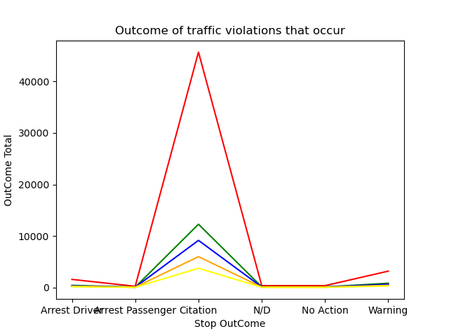
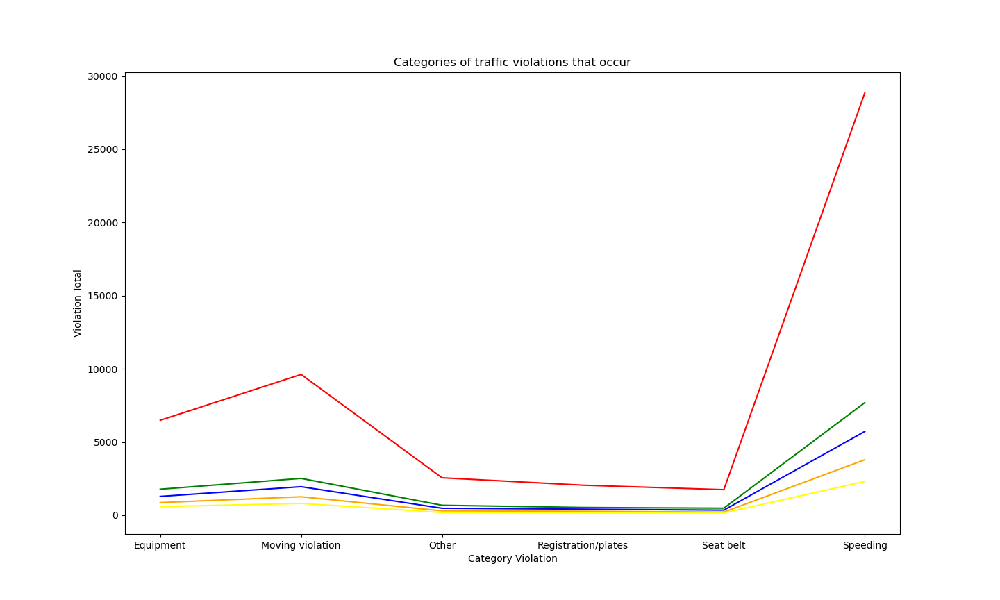
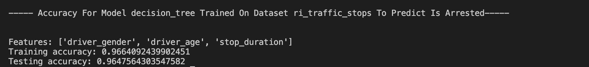
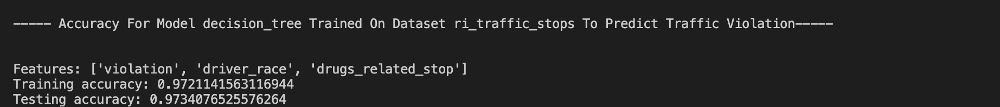
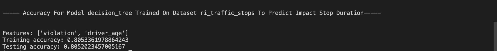
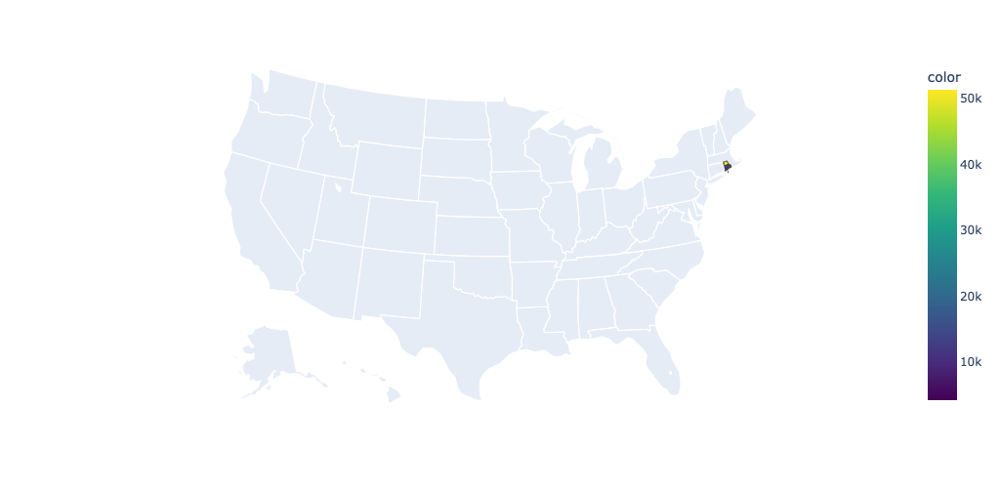

# Data Visualization Of Group D

## Visualization Scenarios

------------------------------------------------------------------------------------------------------------

### Stage 1: Data Visualization in Data Exploration

0. **Aspect**:
    - **Question**: *We want to analyze stop outcome each country*.
    - **Graph & Analysis**:
        

1. **Aspect One**:
    - **Question**: *How many traffic violations occur each year each country ?*
    - **Graph & Analysis**: 

2. **Aspect Two**:
    - **Question**: *How many offenders are between age of 16 and age of 19 each country ?*
    - **Graph & Analysis**: 

3. **Aspect Three**:
    - **Question**: *What are the categories of traffic violations that occur each country ?*
    - **Graph & Analysis**: 

------------------------------------------------------------------------------------------------------------

### Stage 2: Data Visualization for Model Exploration

1. **Aspect One**:
    - **Question**: *Can the driver_gender, driver_age, and stop_duration features be used to predict is_arrested ?*
    - **Graph & Analysis**: 

2. **Aspect Two**:
    - **Question**: *Can violation, driver_race, and drug_related features be used to predict traffic_stop ?*
    - **Graph & Analysis**: 

3. **Aspect Three**:
    - **Question**: *Can the violation and driver_age features affect the stop_duration ?*
    - **Graph & Analysis**: 

------------------------------------------------------------------------------------------------------------

### Stage 3: Data Visualization for *SICK* Applications (20 points)

------------------------------------------------------------------------------------------------------------

### Stage N: Extra credit plots (maximum +15 points, +5 points max for each aspect)
*Feel free to delete this section if you are planning to not implement extra credit*

------------------------------------------------------------------------------------------------------------

## Socially Responsible Computing

1.
    - **Question**: Please list at least three examples of accessible practices in data visualization ?.
    - **Answer**: *Minimalism, Add Alt Text / Label, Label Data Directly*
                

2.
    - **Question**: Evaluate the accessibility of the graphs that you produced. Please refer to the specific questions on the handout.
    - **Answer**:
        *Your answer here*

3.
    - **Question**: (7 points) Reflect on the stages of your design and implementation process. Please refer to the specific questions on the handout.
    - **Answer**:
        *Your answer here*

